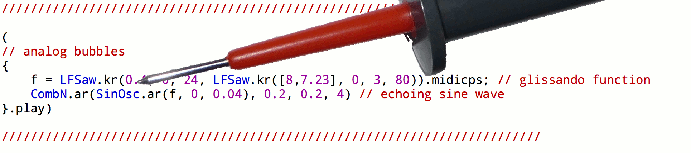

# A Code Bending Library
(SuperCollider Quark)

Code bending is, analogous to circuit bending, a way to reuse the internal wiring of a signal flow. This class opens up enclosed UGen inputs for such external modification and allows for interaction with them without explicit change in the code. Different class methods are provided for different ways to do this.

